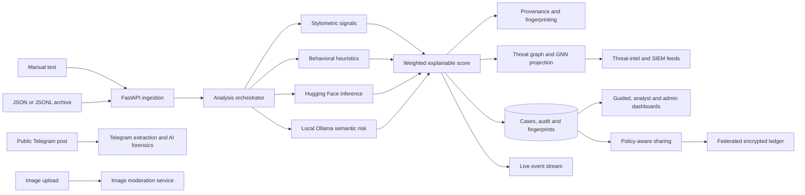

# TattvaDrishti

## Internship Project Pitch and Technical Portfolio

**Project type:** AI-assisted threat-intelligence and malign-information analysis prototype  
**Team:** ASHTOJ  
**Institute:** Keshav Memorial Institute of Technology (KMIT)  
**Origin:** Smart India Hackathon project, extended as an engineering and internship portfolio project  
**Primary domain:** Artificial intelligence, cybersecurity, information operations, digital forensics and secure intelligence sharing

**Repository baseline reviewed:** 22 July 2026, including the batch-processing and Telegram-ingestion additions through commit `d1035ae`. Claims in this document were cross-checked against the current implementation, not only the older project summaries.

---

## 1. One-line pitch

**TattvaDrishti is a multi-modal decision-support platform that helps analysts identify AI-generated or manipulative content, understand why it is risky, discover coordinated activity and share intelligence through an auditable federated workflow.**

## 2. 30-second elevator pitch

Modern disinformation campaigns move faster than a human analyst can manually inspect them. TattvaDrishti reduces that workload by accepting individual messages, large chat archives, public Telegram posts and images, then combining local LLM reasoning, transformer-based AI detection, behavioral signals and stylometric analysis into an explainable risk assessment. It also adds provenance checks, graph-based coordination analysis, live dashboards, geographic risk visualization and encrypted federated sharing. The system is designed as analyst decision support: it prioritizes evidence and explains signals while leaving the final judgement to a human.

## 3. 90-second interview pitch

TattvaDrishti began with a simple question: how can a police, defence or intelligence analyst quickly inspect suspicious digital content without relying on one opaque AI model?

We built an end-to-end prototype around a multi-signal detection pipeline. A message is analysed for linguistic structure, behavioral manipulation, AI-generation probability and semantic risk. The platform then produces a composite score, a four-level classification, plain-language findings and the reasons behind the decision. In parallel, it verifies content fingerprints and watermark markers, updates a threat graph connecting actors, narratives, regions and content, persists an audit trail and pushes live events to the interface.

We later expanded the project in two important directions. First, batch ingestion can process JSON, JSONL and NDJSON message archives while preserving evidence lineage, isolating invalid records and using bounded, vectorized model execution. Second, public Telegram ingestion can extract and sanitize a post directly from its link, estimate whether it is AI- or human-written and return lexical and structural telemetry. The platform also analyses images, exposes SIEM and threat-intelligence feeds, visualizes geographic risk and supports signed, encrypted sharing through a four-node federated ledger simulation.

The strongest engineering lesson was that a useful AI system is not only a model. It also needs explainability, ingestion, reliability, auditability, secure sharing and an interface that works for both technical analysts and time-constrained non-technical officers.

---

## 4. Problem statement

Malign information operations use social platforms, messaging channels and AI-generated media to spread propaganda, trigger emotional reactions, coordinate narratives and overwhelm investigators with volume. Existing workflows often have one or more of these limitations:

- Analysts must manually copy, clean and review large quantities of text.
- Single-model classifiers provide a probability without enough operational context.
- Evidence from different channels is difficult to correlate across actors, regions and recurring narratives.
- Bulk exports lose source identifiers and handling metadata when moved between systems.
- Intelligence sharing can expose personal data or lack a verifiable audit trail.
- Complex interfaces slow down non-technical users who only need a clear priority and explanation.

TattvaDrishti addresses these limitations by connecting ingestion, multi-signal analysis, explainability, graph intelligence, provenance, storage, visualization and sharing in one modular platform.

## 5. Target users

The platform supports three levels of use:

1. **Field and non-technical personnel** — police officers, enforcement personnel and operational staff who need a guided message or image check with a simple priority result.
2. **Intelligence analysts** — users who need detailed score breakdowns, model signals, provenance, case history, threat graphs, geographic context and sharing controls.
3. **Superusers and administrators** — users responsible for federated ledger health, node validation, network synchronization and global risk monitoring.

The platform does not autonomously determine guilt, intent or enforcement action. It is designed to prioritize content for informed human review.

---

## 6. What the current project can do

### 6.1 Manual narrative analysis

An analyst can paste a message or narrative, identify its language and region and optionally add source, platform, actor and tag metadata. The platform:

- validates the intake and requires a location for geographic analysis;
- accepts text from 20 to 20,000 characters;
- generates a unique case identifier and timestamp;
- executes the detection, provenance and graph pipeline;
- stores the complete result and audit event;
- broadcasts a live completion event to connected dashboards; and
- presents the priority, evidence and explanation in the UI.

The intake form also supports browser speech recognition for dictation and city suggestions for faster data entry.

### 6.2 Multi-signal text detection

The composite risk score is not based on a single classifier. When all services are available, it blends:

| Signal | Current weight | Purpose |
| --- | ---: | --- |
| Local Ollama semantic assessment | 40% | Understands contextual danger, manipulation and intent. |
| Hugging Face AI detection | 35% | Estimates whether content is AI- or human-generated. |
| Behavioral analysis | 15% | Detects urgency, calls to action, emotional manipulation, platform risk and metadata cues. |
| Stylometric analysis | 10% | Measures linguistic regularity and machine-like writing patterns. |

If an optional model is unavailable, the engine redistributes weight across the signals that remain instead of failing the entire request.

The score is converted into four operational tiers:

- **Critical risk:** score at or above 0.75
- **High risk:** score at or above 0.60
- **Medium risk:** score at or above 0.35
- **Low risk:** score below 0.35

These thresholds are prototype prioritization rules and should be calibrated on representative operational datasets before deployment.

### 6.3 Explainable linguistic and behavioral evidence

The detector extracts features such as:

- moving-average type-token ratio for lexical diversity;
- character entropy and vocabulary concentration;
- phrase repetition and hapax-word ratios;
- sentence-length variance and burstiness;
- punctuation variety and capitalization;
- readability and function-word coverage;
- urgency and emotionally loaded terms;
- calls to action and aggressive formatting;
- external-link frequency;
- narrative coherence and topic drift;
- high-risk platform and intelligence-tag matches.

Instead of only showing a score, TattvaDrishti returns a summary, up to five key findings, the detailed detection breakdown and a human-readable decision reason.

### 6.4 AI-generation and model-family analysis

The Hugging Face integration supports transformer-based AI-versus-human classification. The detector can load a full model or a PEFT/LoRA adapter, select CPU or CUDA execution and run vectorized inference for batches. Where configured, a second classifier can estimate the likely model family and return the complete family probability distribution.

Model loading is defensive: optional inference can be disabled for lightweight nodes or tests, and the rest of the analysis pipeline continues to operate.

### 6.5 New feature: batch message archive processing

TattvaDrishti now accepts collections through two endpoints:

- a versioned JSON envelope; and
- uploaded `.json`, `.jsonl` or `.ndjson` files.

The batch format preserves operational lineage including:

- upstream message and conversation identifiers;
- observation timestamp;
- source system and collection identifier;
- classification or handling marking;
- platform, region, actor, URLs and source-specific attributes; and
- common defaults inherited by individual records.

Key engineering characteristics include:

- a configurable default limit of 5,000 records and 25 MiB per request;
- per-record validation and line-numbered errors for JSON Lines;
- valid records continuing even when other records are malformed;
- bounded CPU feature preparation;
- vectorized transformer inference with a model lock;
- bounded Ollama parallelism;
- ordered graph mutation and SQLite persistence;
- one consistent post-batch graph summary instead of repeated quadratic recomputation;
- indexed storage of batch IDs and external message IDs; and
- per-item success/error results with total duration and counts.

This turns the platform from a single-message demo into a prototype that can ingest real evidence exports and historical chat collections.

### 6.6 New feature: Telegram post ingestion

An analyst can submit a public Telegram post link in the form `https://t.me/channel/message-id`. The specialised Telegram workflow:

1. validates that the link targets a public Telegram post;
2. requests Telegram's public embed representation;
3. extracts the message, author, channel, post ID, timestamp and available view metadata;
4. decodes HTML and removes markup, custom emoji, embedded URLs and excess whitespace before inference;
5. runs DeBERTa/LoRA-based AI-versus-human inference; and
6. returns AI and human confidence together with lexical richness, words per sentence, exclamation markers, word count, character count and sentence count.

The connector distinguishes invalid links, private sources, rate limits and extraction failures. A separate Telegram bot webhook parser can also handle messages, channel posts, edits, captions and forwarded-source metadata.

The direct Telegram endpoint is currently a specialised AI-forensics flow. It does not yet persist the post as a full TattvaDrishti case or run every stage of the main orchestration pipeline.

### 6.7 Image and media analysis

The image workflow sends an uploaded file and selected detection models to Sightengine. The interface supports:

- AI-generated image detection;
- violence detection;
- gore detection;
- offensive-content scoring;
- self-harm detection;
- text-content inspection;
- QR-code inspection; and
- image properties such as sharpness, brightness, contrast, dimensions and dominant colour.

The interface allows the analyst to select only the signals relevant to the investigation and presents confidence values as clear risk indicators.

### 6.8 Provenance and fingerprint checks

Every full narrative intake receives:

- a SHA-256 content hash;
- a check for the project's embedded watermark marker;
- a check for its rotating signature marker;
- validation notes explaining missing or mismatched markers; and
- a normalized fingerprint stored for later exact or case/whitespace-normalized matching.

The fingerprint API can identify previously seen content and connect reappearances to existing intake IDs.

### 6.9 Threat graph and coordination intelligence

The NetworkX graph links:

- content;
- actors;
- narrative tags; and
- regions.

From these relationships, the project produces:

- high-risk actor rankings;
- connected-community snapshots;
- optional PyTorch-based GNN-like risk projections;
- higher-risk clusters;
- coordination alerts based on shared narratives and actors; and
- potential propagation chains across content and platforms.

This changes the analytical question from “Is this one message suspicious?” to “How might this message relate to a wider campaign?”

### 6.10 Threat-intelligence and SIEM integration

The backend exposes two integration-oriented feeds:

- a threat-intelligence feed containing the graph summary, indicators and a dataset fingerprint; and
- a SIEM correlation payload containing alerts, propagation chains, correlation keys and node counts.

These interfaces demonstrate how TattvaDrishti could feed an existing security operations or intelligence platform instead of operating only as a standalone dashboard.

### 6.11 Geographic risk heatmap

Every full intake with a recognised region can record its normalized score as a geographic risk point. The heatmap API persists these points and the Leaflet-based interface visualizes regional risk distribution. This helps supervisors identify where suspicious narratives are appearing and how risk is distributed geographically.

### 6.12 Policy-aware intelligence sharing

An analyst can generate a sharing package for a selected case and destination. The workflow:

- includes a justification for the transfer;
- redacts actor identifiers by default unless personal data is explicitly requested;
- applies restricted, privacy and export-review policy tags;
- includes the case classification and composite score;
- signs a canonical package envelope using SHA-256 and the application secret;
- creates a visual multi-hop route to the destination; and
- records package generation in the audit log.

The hop trace is a simulation used to explain routing and policy decisions; its IP addresses, latency and route selection are not measurements of a real intelligence network.

### 6.13 Federated, tamper-evident ledger

The project includes a four-node federation representing USA, EU, India and Australia. Docker Compose starts the nodes on separate ports with isolated data volumes.

Ledger capabilities include:

- encrypted block payloads using Fernet;
- Ed25519 block signatures;
- SHA-256 block hashes and previous-hash linkage;
- a genesis block and SQLite-backed chain storage;
- block reception and integrity validation;
- local and network validation endpoints;
- identification of invalid or unreachable nodes;
- longest-valid-chain synchronization; and
- administrative decryption and reset operations.

The sharing orchestrator can publish a case-sharing event to the selected destination node. The ledger is a permissioned federation prototype, not a public blockchain or production consensus protocol.

### 6.14 Real-time and role-specific interfaces

The Next.js frontend provides three experiences:

#### Guided dashboard (`/simple`)

- modern, low-clutter flow for non-technical users;
- message and image tabs;
- essential inputs first and optional context on demand;
- plain-language priority and recommended next step;
- risk score, key signals and collapsible evidence;
- filterable session history;
- live connection status; and
- responsive, keyboard-accessible layout.

#### Analyst dashboard (`/`)

- public Telegram intake and AI-forensics telemetry;
- manual narrative intake;
- bulk archive upload;
- live metrics and SSE event feed;
- case table and detailed forensic drill-down;
- radar, speedometer and score visualizations;
- image moderation;
- intelligence sharing and hop trace;
- blockchain controls and topology; and
- global risk heatmap.

#### Superuser dashboard (`/superuser`)

- intended system-health monitoring;
- blockchain network topology;
- chain validation and synchronization; and
- global geographic risk visualization.

The application also includes light/dark theming, toast feedback and automatic SSE reconnection.

---

## 7. End-to-end architecture

### Main request flow

1. Intake is validated and normalized.
2. Stylometric and behavioral features are prepared.
3. Optional transformer and Ollama inference is executed.
4. Available signals are combined into a bounded composite score.
5. The score is classified and converted into an explanation.
6. Provenance and fingerprints are calculated.
7. Actors, narratives, regions and content are added to the threat graph.
8. The case, lineage and audit event are persisted in SQLite.
9. A Server-Sent Event updates connected dashboards.
10. An analyst can retrieve, correlate or share the resulting case.

---

## 8. Technology stack

| Layer | Technologies |
| --- | --- |
| Backend API | Python, FastAPI, Pydantic, Uvicorn |
| AI and NLP | Hugging Face Transformers, PyTorch, PEFT/LoRA, Ollama |
| Text analytics | Custom stylometry, behavioral heuristics and semantic scoring |
| Graph intelligence | NetworkX with optional PyTorch tensor projection |
| Data and audit | SQLite, JSON serialization and indexed fingerprints |
| Security and federation | Fernet encryption, Ed25519 signatures, SHA-256 hashing |
| Frontend | Next.js 14, React 18, Tailwind CSS |
| Maps and visualisation | Leaflet, Leaflet Heat and custom SVG/canvas charts |
| External media analysis | Sightengine API |
| Real-time transport | Server-Sent Events / EventSource |
| Deployment | Docker and Docker Compose |
| Quality | Pytest and deterministic model-disable switches |

---

## 9. Important engineering decisions

### Ensemble instead of a single model

AI-generation detection alone cannot determine whether a message is operationally dangerous. The ensemble keeps “who or what may have written this?” separate from “what is the message trying to achieve?” and adds observable linguistic and contextual signals.

### Graceful degradation

Hugging Face and Ollama are optional at runtime. The scoring logic rebalances available signals, enabling development on CPU-only machines and resilient operation when a model service is temporarily unavailable.

### Explainability by construction

The engine records features and heuristics during scoring rather than attempting to explain a black-box verdict afterwards. These signals are used to produce findings, summaries and decision reasons.

### Ordered state changes during batch work

Transformer inference benefits from vectorization, but the graph and SQLite database contain shared mutable state. TattvaDrishti batches model work while preserving ordered graph mutation and persistence, balancing throughput with consistency.

### Evidence lineage

Batch messages keep upstream IDs, timestamps, collections and classification markings. This is essential for connecting an analytical result back to its original evidence source.

### Progressive disclosure in the UI

The guided dashboard shows only the minimum information required to begin. Technical fields and original evidence remain available, but do not obstruct time-constrained users.

### Human-in-the-loop positioning

Risk tiers are presented as prioritization guidance. The UI explicitly states that results do not establish guilt or intent, reducing the risk of treating probabilistic output as an enforcement decision.

---

## 10. Measurable implementation scope

The current repository demonstrates:

- four weighted text-risk signals;
- four operational risk tiers;
- four distinct ingestion paths: manual, batch, Telegram and image;
- three role-oriented web experiences;
- eight selectable image-analysis categories;
- four simulated federation nodes;
- support for up to 5,000 batch records by default;
- 25 MiB default batch upload protection;
- live SSE updates with bounded queue behavior;
- threat-intelligence, SIEM, fingerprint, heatmap and ledger APIs; and
- automated tests covering heuristic detection, batch parsing/execution and PII-redacted sharing behavior.

These are engineering scope indicators, not accuracy or operational-performance claims. A formal benchmark dataset and deployment-level load test are still required.

---

## 11. Team contribution map

| Team member | Primary contribution |
| --- | --- |
| Shaik Mohammed Omar | Team lead; system vision and architecture; backend APIs; AI/ML integration; forensic and ledger integration; rapid feature iteration. |
| Shoaib | Core backend and AI systems; model integration; system logic; debugging, optimization and end-to-end stability. |
| Tanishq | Blockchain and infrastructure lead; federated node and ledger implementation; Git workflow and integration management. |
| Anirudha | Image moderation implementation; presentations and evaluation communication. |
| Hansika | UI/UX concepts, visual layout and presentation assets. |
| Jinal | UI/UX structuring, documentation support and presentation design. |

### Suggested personal-contribution pitch

Use the version that matches your role and replace the bracketed details:

> “My main responsibility in TattvaDrishti was **[your ownership area]**. I worked on **[two or three concrete modules]**, and my most important contribution was **[specific problem you solved]**. The difficult part was **[technical constraint]**, which I addressed by **[design or debugging decision]**. This improved **[reliability, usability, throughput, explainability or integration]**. Working on the project taught me how to connect AI models with real APIs, data flows, security controls and user-facing workflows rather than treating the model as an isolated notebook.”

---

## 12. Five-minute demonstration plan

### 0:00–0:40 — Introduce the problem

Explain that analysts face both high content volume and ambiguous AI-generated material. Emphasize that the system supports decisions and prioritization rather than autonomous enforcement.

### 0:40–1:30 — Guided message analysis

Open `/simple`, paste a suspicious message, select its language and location and run the check. Show the priority, recommended action, risk score, explanation and detected signals.

### 1:30–2:15 — Analyst depth

Switch to the analyst workspace. Open the same case and show the stylometric, behavioral, AI, Ollama, provenance and graph sections. Point out that the explanation is generated from stored analysis evidence.

### 2:15–2:55 — New ingestion features

Paste a public Telegram link and show extracted text, AI/human confidence and lexical telemetry. Then show a JSONL archive upload and explain per-record error isolation and preserved source identifiers.

### 2:55–3:35 — Coordination and geography

Show how cases contribute to graph clusters, actor/narrative relationships and geographic heat points. Mention the threat-intelligence and SIEM outputs.

### 3:35–4:25 — Secure sharing

Generate a privacy-redacted package for a destination. Show policy tags, signature and hop trace, then open the federated ledger to explain encryption, signatures and tamper validation.

### 4:25–5:00 — Close with engineering value

Summarize the modular architecture, graceful model fallbacks and the progression from single-message analysis to multi-source and batch workflows. End with the production roadmap rather than claiming the prototype is already deployment-ready.

---

## 13. Challenges solved and lessons learned

### Combining heterogeneous AI signals

Different services return different confidence structures and can fail independently. The project normalizes their outputs, handles missing signals and returns a consistent typed result.

### Preserving responsiveness around blocking models

AI inference, SQLite operations and network calls can block an asynchronous API. The orchestrator uses dedicated worker execution and bounded concurrency to protect the event loop and shared resources.

### Processing imperfect evidence archives

Real exports contain malformed lines and partial metadata. JSON Lines parsing isolates errors and reports their exact line without discarding valid evidence in the same file.

### Correlating cases rather than scoring them independently

The graph layer required stable node types and relationships between content, actors, tags and locations. Summaries then had to remain understandable enough for UI and SIEM consumers.

### Designing for two very different user groups

Analysts want detailed evidence while field users need a quick answer. The project uses separate role-oriented experiences and progressive disclosure instead of forcing one dense interface on everyone.

### Separating prototype realism from production claims

The project intentionally demonstrates cryptography, federation, AI inference and policy tagging, while documenting where secrets management, calibrated models, stronger identity and production storage are still needed.

---

## 14. Current limitations and responsible positioning

The following points should be stated honestly in an interview or evaluation:

- Detection scores have not yet been calibrated against a large, independently labelled operational dataset.
- AI-generation detectors can produce false positives, particularly for edited, translated or very short text.
- Telegram extraction supports public post previews; private groups require an authorized integration and platform-compliant access.
- The Telegram direct-analysis flow is not yet connected to full case persistence and graph ingestion.
- SQLite is appropriate for a portable prototype, but PostgreSQL or another production database is needed for high concurrency.
- Graph state and SSE queues are currently in memory and should move to durable shared infrastructure for horizontal scaling.
- Role resolution is a prototype registry/header mechanism with an open development-mode bypass, not enterprise identity management.
- The image workflow depends on an external API and therefore has privacy, availability and cost considerations.
- Federation is a permissioned simulation without Byzantine consensus, mTLS, HSM-backed keys or production governance.
- Hop routes and network latency are demonstrative rather than real telemetry.
- Secrets and API credentials must be removed from source defaults, rotated and managed through a vault before any deployment.
- The superuser route currently references a missing `SystemMonitor` component and requires that integration to be restored or removed before a clean production frontend build.

These limitations do not reduce the project's portfolio value; they show awareness of the difference between a successful prototype and a secure production system.

---

## 15. Production roadmap

### Phase 1 — Reliability and security hardening

- Move all secrets to a managed vault and rotate exposed development credentials.
- Replace header-based roles with OIDC/SAML identity and fine-grained authorization.
- Add input malware scanning, rate limits, request tracing and security headers.
- Fix the superuser build dependency and add frontend automated tests.
- Add an explicit model-health and dependency-health endpoint.

### Phase 2 — Data and scale

- Replace SQLite with PostgreSQL.
- Move graph state to Neo4j or a durable graph store.
- Use Redis/Kafka for events and a durable job queue for large batches.
- Store evidence in encrypted object storage with retention and legal-hold policies.
- Add idempotency keys and resumable asynchronous batch jobs.

### Phase 3 — Model validation

- Build a representative multilingual benchmark dataset.
- Measure precision, recall, calibration and false-positive rates by source and language.
- Add analyst feedback loops and threshold versioning.
- Protect against prompt injection and adversarial text manipulation.
- Add drift monitoring and model-card documentation.

### Phase 4 — Operational integration

- Connect authorized Telegram and other social-platform APIs.
- Export STIX/TAXII-compatible intelligence objects.
- Add SIEM connectors for common platforms.
- Implement real partner-node identity, mTLS and governed key rotation.
- Add case assignment, review status, evidence chain-of-custody and approval workflows.

---

## 16. Likely interview questions and strong answers

### Why not rely entirely on an LLM?

An LLM adds semantic understanding, but it is not deterministic and may be unavailable. TattvaDrishti combines it with transformer classification, observable behavioral indicators and custom stylometry. This makes the result more resilient and gives the analyst evidence beyond one model's response.

### What is innovative about the project?

The value is the integration of multiple operational layers: multi-signal detection, explainability, evidence lineage, public-channel ingestion, batch execution, provenance, graph correlation, real-time interfaces and privacy-aware sharing. It demonstrates a complete intelligence workflow rather than a standalone classifier.

### How does batch processing improve over looping through the single endpoint?

It validates a versioned collection, preserves upstream lineage, batches transformer inference, limits LLM concurrency, isolates record failures and mutates shared state in order. It also computes one consistent graph snapshot after the batch, avoiding repeated expensive summaries.

### How do you prevent the AI from making enforcement decisions?

The UI labels outputs as priority assessments, shows the contributing evidence and states that human review is required. In production, decisions would also require role-based approval, model-calibration records and an auditable analyst action.

### Why use a blockchain-like ledger?

The goal is not cryptocurrency. The ledger demonstrates tamper evidence, signed origin, encrypted payloads and verification across partner nodes. For some deployments, an append-only signed database may be simpler; the architecture should be selected according to governance requirements.

### What happens when Ollama or Hugging Face is unavailable?

The integration returns no model score instead of terminating the request. The ensemble redistributes weight over available signals, so the system still produces a result and its breakdown shows which evidence was present.

### What would you improve first?

First, rotate and externalize secrets, replace prototype authentication and fix the clean build. Next, establish an evaluation dataset and calibration process. Only after accuracy and security baselines would I scale storage and connect additional live sources.

### What did this project teach you?

It taught us that production-oriented AI engineering includes far more than model inference: schemas, data quality, concurrency, explainability, audit trails, security, failure handling, user experience and honest communication of limitations are equally important.

---

## 17. Closing statement

TattvaDrishti demonstrates the ability to turn AI research concepts into a complete, explainable and user-oriented system. It combines backend engineering, model integration, concurrent batch processing, social-content ingestion, graph analytics, cryptography, real-time interfaces and deployment tooling within one coherent workflow.

For an internship, the project is strong evidence of:

- end-to-end ownership;
- learning across unfamiliar technologies;
- designing around real users and operational constraints;
- integrating AI safely instead of treating it as a black box;
- debugging complex interactions between models, APIs, storage and UI; and
- understanding the path from prototype to production.

**TattvaDrishti is not presented as a finished enforcement system. It is presented as a substantial, extensible prototype and a clear demonstration of applied AI and full-stack engineering ability.**
